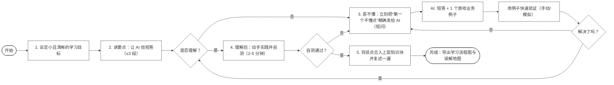

# jk自己的学习方法

## 1. 通过AI快速检索信息
AI会给出很长的大段信息，如果中途遇到很多不理解的地方，递归学习很麻烦，所以需要减少AI每次回答的篇幅，尽量控制不理解的知识出现的频率，遇到不理解的东西时立即发给AI让其回答，然后再仔细品读此次回答，试图理解，可以适当让AI给出一些例子方便理解，当完成一整块知识的学习时，退到最上层，看看是否可以完全的理解。如果不能理解，请继续这个过程。直到完全理解这一块的知识。结束的时候可以让AI画出一个此次学习的流程图（遇到的知识点，自己的误解区），这样可以加深自己的理解，整理出更适合自己的知识点，方便以后复习。

